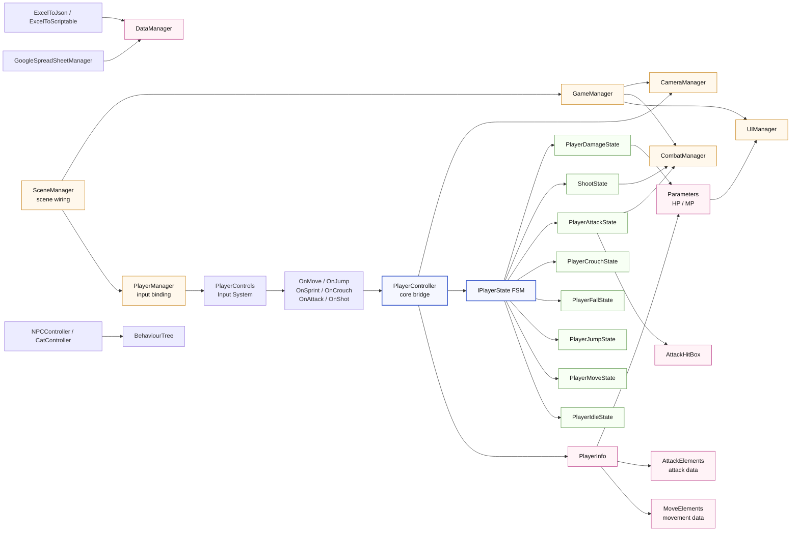

## Architecture Diagram

# Graph Report - Assets/01_Scripts  (2026-05-16)

## Corpus Check
- Corpus is ~4,176 words - fits in a single context window. You may not need a graph.

## Summary
- 228 nodes · 294 edges · 15 communities (10 shown, 5 thin omitted)
- Extraction: 100% EXTRACTED · 0% INFERRED · 0% AMBIGUOUS
- Token cost: 0 input · 0 output

## Community Hubs (Navigation)
- [[_COMMUNITY_Player Controller Core|Player Controller Core]]
- [[_COMMUNITY_Player State Interface|Player State Interface]]
- [[_COMMUNITY_Managers And Combat|Managers And Combat]]
- [[_COMMUNITY_Stats And UI|Stats And UI]]
- [[_COMMUNITY_NPC Behaviour Tree|NPC Behaviour Tree]]
- [[_COMMUNITY_Google Sheet Import|Google Sheet Import]]
- [[_COMMUNITY_Data Serialization|Data Serialization]]
- [[_COMMUNITY_Jump And Fall States|Jump And Fall States]]
- [[_COMMUNITY_Camera Control|Camera Control]]
- [[_COMMUNITY_Combat Data Models|Combat Data Models]]
- [[_COMMUNITY_Melee Attack State|Melee Attack State]]
- [[_COMMUNITY_Movement State|Movement State]]
- [[_COMMUNITY_Scene Wiring|Scene Wiring]]
- [[_COMMUNITY_Excel Scriptable Export|Excel Scriptable Export]]
- [[_COMMUNITY_Excel JSON Export|Excel JSON Export]]

## God Nodes (most connected - your core abstractions)
1. `PlayerController` - 38 edges
2. `IPlayerState` - 13 edges
3. `CameraManager` - 13 edges
4. `GoogleSpreadSheetManager` - 10 edges
5. `UIManager` - 9 edges
6. `PlayerMoveState` - 8 edges
7. `PlayerJumpState` - 8 edges
8. `PlayerAttackState` - 8 edges
9. `float` - 8 edges
10. `DataManager` - 8 edges

## Surprising Connections (you probably didn't know these)
- `PlayerController` --references--> `bool`  [EXTRACTED]
  Player/PlayerController.cs → Util/StatusData.cs
- `PlayerDamageState` --references--> `float`  [EXTRACTED]
  FSM.cs → Util/StatusData.cs
- `PlayerDamageState` --references--> `int`  [EXTRACTED]
  FSM.cs → Util/StatusData.cs
- `CameraManager` --references--> `float`  [EXTRACTED]
  Player/CameraManager.cs → Util/StatusData.cs
- `PlayerController` --references--> `float`  [EXTRACTED]
  Player/PlayerController.cs → Util/StatusData.cs

## Communities (15 total, 5 thin omitted)

### Community 0 - "Player Controller Core"
Cohesion: 0.07
Nodes (9): Action, AudioSource, CameraManager, Collider2D, IPlayerState, PlayerController, PlayerInfo, RaycastHit2D (+1 more)

### Community 1 - "Player State Interface"
Cohesion: 0.09
Nodes (6): IPlayerState, PlayerCrouchState, PlayerDamageState, PlayerIdleState, PlayerSkillState, ShootState

### Community 2 - "Managers And Combat"
Cohesion: 0.09
Nodes (12): CharacterController, MemoryChecker, DataManager, GoogleSpreadSheetManager, CombatManager, IDamageable, GameManager, PlayerManager (+4 more)

### Community 3 - "Stats And UI"
Cohesion: 0.09
Nodes (11): Parameters, AttackHitBox, ContactFilter2D, Ease, float, UIManager, AttackElements, MoveElements (+3 more)

### Community 4 - "NPC Behaviour Tree"
Cohesion: 0.14
Nodes (9): CatController, List, CharmingNode, FollowingNode, Node, Selector, Sequence, StandingNode (+1 more)

### Community 5 - "Google Sheet Import"
Cohesion: 0.18
Nodes (9): Dictionary, CreateClasses(), CreateScriptableClass(), GetCSharpType(), GoogleSpreadSheetManager, SetVariables(), ScriptableObject, DialogueSO (+1 more)

### Community 6 - "Data Serialization"
Cohesion: 0.16
Nodes (8): bool, int, JsonSerializerOptions, DataManager, string, DialogueData, ExcelToScriptable, StatusData

### Community 8 - "Camera Control"
Cohesion: 0.18
Nodes (5): BoxCollider2D, Camera, CameraManager, Transform, Vector3

### Community 9 - "Combat Data Models"
Cohesion: 0.22
Nodes (6): AttackElements, EnemyManager, IDamageable, MoveElements, Parameters, PlayerInfo

### Community 13 - "Excel Scriptable Export"
Cohesion: 0.53
Nodes (5): CheckFiles(), CreateScriptables(), Excel, FetchExcel(), GetTables()

## Knowledge Gaps
- **27 isolated node(s):** `JsonSerializerOptions`, `GoogleSpreadSheetManager`, `DataManager`, `PlayerControls`, `TMP_Text` (+22 more)
  These have ≤1 connection - possible missing edges or undocumented components.
- **5 thin communities (<3 nodes) omitted from report** — run `graphify query` to explore isolated nodes.

## Suggested Questions
_Questions this graph is uniquely positioned to answer:_

- **Why does `PlayerController` connect `Player Controller Core` to `Combat Data Models`, `Managers And Combat`, `Stats And UI`, `Data Serialization`?**
  _High betweenness centrality (0.374) - this node is a cross-community bridge._
- **Why does `PlayerDamageState` connect `Player State Interface` to `Stats And UI`, `Data Serialization`?**
  _High betweenness centrality (0.370) - this node is a cross-community bridge._
- **Why does `float` connect `Stats And UI` to `Camera Control`, `Player State Interface`, `Player Controller Core`, `Data Serialization`?**
  _High betweenness centrality (0.322) - this node is a cross-community bridge._
- **What connects `JsonSerializerOptions`, `GoogleSpreadSheetManager`, `DataManager` to the rest of the system?**
  _27 weakly-connected nodes found - possible documentation gaps or missing edges._
- **Should `Player Controller Core` be split into smaller, more focused modules?**
  _Cohesion score 0.07 - nodes in this community are weakly interconnected._
- **Should `Player State Interface` be split into smaller, more focused modules?**
  _Cohesion score 0.09 - nodes in this community are weakly interconnected._
- **Should `Managers And Combat` be split into smaller, more focused modules?**
  _Cohesion score 0.09 - nodes in this community are weakly interconnected._
